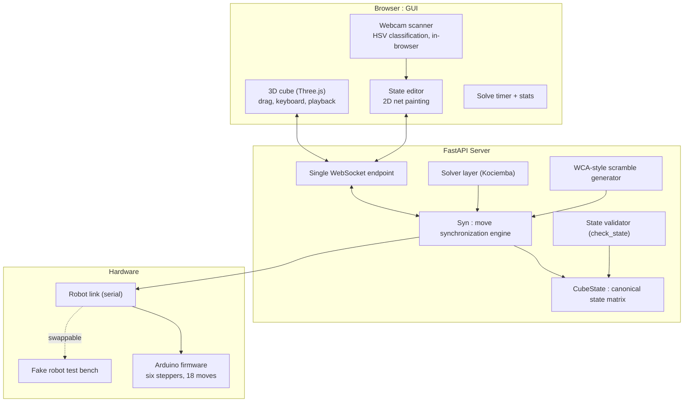
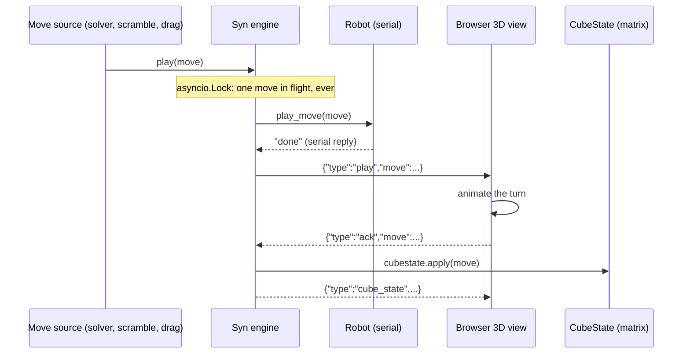

# RubikCube : Full Technical Write-Up
## Simulator, Solver, and Robot as One Synchronized System

**Version:** 1.0
**Author:** Ahmed Nassem
**Date:** September 2026

---

## Table of Contents

1. [Overview](#1-overview)
2. [System Architecture](#2-system-architecture)
3. [The Syn Engine : Move Synchronization](#3-the-syn-engine--move-synchronization)
4. [The WebSocket Protocol](#4-the-websocket-protocol)
5. [Solving](#5-solving)
6. [Cube-State Acquisition](#6-cube-state-acquisition)
7. [The Robot](#7-the-robot)
8. [The Live Demo](#8-the-live-demo)
9. [Design Decisions](#9-design-decisions)
10. [Honest Limits](#10-honest-limits)
11. [Future Work](#11-future-work)

---

## 1. Overview

RubikCube takes a Rubik's Cube from a physical scramble to a solved state, in simulation and in the real world. One Python backend owns a canonical cube state; one browser front-end renders a fully interactive 3D cube; one serial-connected robot turns the real plastic. The core engineering problem: these are **three copies of the same cube**, and the entire design exists to keep them from ever disagreeing.

The stack: FastAPI + WebSockets on the server, Three.js in the browser, Arduino/PlatformIO firmware on the robot, and the Kociemba two-phase algorithm for solving.

The full demo in action (the same backend running on the live site, with the fake robot in place of the hardware):

<video src="rc.mp4" controls width="100%"></video>

If the video does not play inline, it lives in the repo root as [`rc.mp4`](rc.mp4).

---

## 2. System Architecture

The server is the single source of truth. Every move (mouse drag, keyboard shortcut, scramble step, solver move, robot command) funnels through the Syn engine before it is allowed to become part of the official cube state.

---

## 3. The Syn Engine : Move Synchronization

The same cube exists three times: pixels in the browser, a state matrix on the server, plastic on the robot. `Syn` (in `syn.py`) keeps them in lockstep with **acknowledgement gating**.

### 3.1 The move pipeline

The ordering is deliberate: **hardware first, view second, state last.** The 3D view is never ahead of the physical cube, and the state matrix is never speculative: it records only what has been confirmed everywhere. When no robot is connected and calibrated, the robot step is skipped and the same GUI-ack-then-commit discipline applies.

### 3.2 Failure semantics

- A robot failure (serial timeout, unexpected reply) makes `play_move` raise: the pipeline aborts **before** commit. The failed move never enters the state matrix, the rest of the batch is cancelled, and the error is exposed via `syn_status`.
- Moves carrying a client `id` get a per-move receipt: `{"type":"move_done","ok":false,"error":...}`.
- If the browser disconnects mid-move, `syn.detach()` fails the pending acknowledgement with a `ConnectionError`, and the camera and robot links are closed.
- There is deliberately no automatic rollback of already-committed moves: committed moves really happened on the hardware, so recovery means re-scanning, not pretending.

### 3.3 The local-drag exception

Dragging a face in the 3D view (with no robot) is the one case where the animation plays first: the browser sends `{"type":"move","local":true}` and the backend just applies the matrix. Waiting for a round-trip before showing your own drag would feel broken; the state still ends up identical.

---

## 4. The WebSocket Protocol

One WebSocket carries everything. The important message types:

| Direction | Type | Purpose |
|---|---|---|
| server → client | `config`, `cube_state`, `robot_status`, `robot_ports`, `fake_status`, `syn_status` | Full sync on connect + status pushes |
| client → server | `move` (± `local`, ± `id`) | A move request (or a locally-applied drag) |
| server → client | `play` | Instruct the GUI to animate a move (Syn pipeline) |
| client → server | `ack` | GUI confirms the animation completed |
| server → client | `move_done` | Per-move receipt (`ok` / `error`) for id'd moves |
| client → server | `action` | Everything else: scramble, solve, reset, robot connect, editor ops |
| server → client | `scramble`, `solve_preview`, `solve_done`, `scramble_blocked`, `reset_done` | Batch operation results |
| server → client | `state_check` | Validation verdict for an edited/scanned state |
| server → client | `fake_move`, `fake_status` | Fake-robot test bench traffic |
| server → client | `camera_started`, `camera_frame`, `camera_error`, ... | Backend camera path (see §6) |

---

## 5. Solving

Solutions come from **Kociemba's two-phase algorithm** via the reference `kociemba` library: the cube state is serialized to the 54-character URFDLB facelet string and solved in milliseconds, with a move-by-move preview (`solve_preview`) before anything is applied.

**In truth:** the UI offers four methods (Kociemba, CFOP, Roux, ZZ), but CFOP/Roux/ZZ are currently selector stubs that fall back to the Kociemba engine (`Solver/__init__.py`). Implementing them stage-by-stage is future work (§11), and would make the method comparison (move count vs. human-style solutions) real.

There is no solver-to-robot move translation layer, and none is needed; see §7.

---

## 6. Cube-State Acquisition

Solving a real cube means first convincing the software of what the real cube looks like. Two paths:

### 6.1 The 2D net editor

Paint any state sticker-by-sticker on an unfolded net. Nothing is accepted until validation passes (§6.3).

### 6.2 The webcam scanner (in-browser)

`createCameraScanner` (`GUI/js/camera.js`) runs entirely client-side: `getUserMedia` frames are sampled off a canvas and each sticker is classified in **HSV color space** (`classifyHsv`). The center sticker identifies which face is being shown, and a face is auto-captured only after **10 consecutive frames classify identically** (`STABLE_FRAMES = 10`), a cheap stability filter against hand shake and lighting flicker. No video ever leaves the browser. (A backend OpenCV path, `cubecam.py`, exists as well; the hosted demo uses the browser scanner.)

### 6.3 Validation : rejecting impossible cubes

A scan or hand-painted state can easily describe a cube that cannot exist. `check_state()` (`setstate.py`) enforces, in order:

| # | Check | Rejects |
|---|---|---|
| 1 | Exactly 54 stickers, characters in URFDLB | Malformed input |
| 2 | Exactly 9 stickers of each color | Miscounted paint jobs |
| 3 | Centers must be the fixed face letters | Rotated/mislabeled scans |
| 4 | `kociemba.solve(state)` must succeed | Physically impossible states (parity, twisted corners) |

An invalid state returns `state_check` with the reason; Save stays disabled and `go_to_state` refuses to play a single move on it.

---

## 7. The Robot

The firmware (`Robot/all_moves.ino`, Arduino/PlatformIO) drives **six stepper motors, one per face**. That single mechanical decision deletes a whole software problem: every one of the 18 standard face turns (U, U', U2, ..., B2) is directly executable, so solver output maps 1:1 to hardware moves with no cube-rotation remapping pipeline. In robot mode the GUI restricts draggable moves to the six face letters (`canDragMove`), matching what the hardware can do.

The hardware adapter board that bridges the six stepper drivers to the Arduino:

The protocol is deliberately simple: one move per serial command, one `"done"` reply, which is exactly the acknowledgement the Syn engine gates on (§3). A **fake robot** speaks the same protocol (including simulated failures) so the whole robot path is developable and testable with no hardware attached.

---

## 8. The Live Demo

The hosted demo runs the actual backend. It is the real application, not a recording. Each visitor gets an independent cube session; the physical robot is replaced by the fake robot; the webcam scanner runs in your browser, so no video is uploaded.

---

## 9. Design Decisions

| # | Decision | Alternative | Rationale |
|---|---|---|---|
| D1 | Server owns canonical state; all moves funnel through Syn | Browser-authoritative state | Three copies of one cube need one referee; the copy attached to the solver and validator wins |
| D2 | Hardware-first commit order (robot → GUI → matrix) | Optimistic UI, reconcile later | A 3D cube that runs ahead of the robot looks fine until a motor stalls; then every later move is garbage |
| D3 | Six motors, one per face | Two/three grippers with cube rotations | Deletes the move-remapping layer entirely; solver letters are hardware commands |
| D4 | Solvability via `kociemba.solve` as the final validator | Hand-rolled parity/orientation checks | The solver must accept the state anyway; using it as the oracle can't disagree with itself |
| D5 | Fake robot behind the same serial protocol | Mocking at the function level | Exercises the timeout/failure paths the real hardware hits, including in the hosted demo |

---

## 10. Honest Limits

- CFOP, Roux, and ZZ are selector stubs over Kociemba today .
- A batch solve that fails mid-run stops and reports status, but there is no structured "failed at move N, here's the recovery" flow; recovery is a re-scan.
- The HSV scanner wants decent lighting; there is no white-balance calibration pass yet.

---

## 11. Future Work

- Implement CFOP/Roux/ZZ for real, stage by stage, and compare move counts against Kociemba on identical scrambles.
- Structured batch-failure reporting with a guided recovery re-scan.
- White-balance calibration from the known center stickers to harden scanning in poor light.

---

*End of write-up.*
