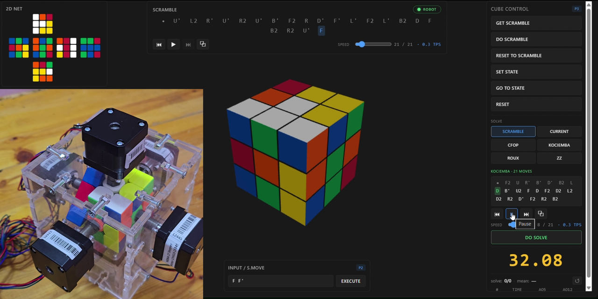

# RubikCube




**Interactive 3D Rubik's Cube simulator, solver, and robot controller.**

A full-stack platform built around one goal: take a Rubik's Cube from a scramble
to a solved state, in simulation and in the real world. The browser renders a
fully interactive 3D cube you can drag face-by-face, while a Python backend
keeps the canonical cube state, generates scrambles, computes solutions, and
can drive a physical solving robot over a serial connection.

**[Try the live demo](https://ahmednassem.com/projects/rubikcube/app/)** :  the
real backend running on a server, with an independent cube session per visitor.

## Features

- **Real-time 3D cube** (Three.js) :  drag faces to turn them, orbit the camera,
  tweak gap, animation speed, sticker labels, and transparency.
- **Scramble generation** with WCA-style move sequences and step-through
  playback controls (play/pause, step forward/back, speed).
- **Four solving methods** :  Kociemba, CFOP, Roux, ZZ :  with a move-by-move
  solution preview before applying it to the cube.
- **Cube state editor** :  paint any state on a 2D net (validated for
  solvability), or scan a physical cube with a **webcam** (OpenCV color
  classification, auto-captures each face when stable).
- **Robot mode** :  the same move stream that animates the on-screen cube drives
  stepper motors on a physical solving robot (Arduino / PlatformIO). A built-in
  **fake robot** test bench simulates the hardware handshake for development.
- **Solve timer** with session statistics (ao5 / ao12 averages).

## Architecture

```
Browser (Three.js GUI)  ⇄  WebSocket  ⇄  FastAPI backend
                                             ├─ CubeState  (canonical 54-sticker matrix + move stack)
                                             ├─ Syn        (move synchronization engine)
                                             ├─ Solvers    (Kociemba / CFOP / Roux / ZZ)
                                             ├─ CubeCam    (OpenCV webcam face scanner)
                                             └─ Robot      (serial bridge to Arduino)
```

The key design piece is **Syn**, the synchronization layer. Every move, whether
it comes from a mouse drag, a scramble, a solver, or the robot, flows through
Syn, which advances the 3D view, the backend state matrix, and the robot in
lockstep with acknowledgement gating:

- **Normal mode:** send move to GUI → await GUI animation ack → commit to state matrix.
- **Robot mode:** send move to robot → await hardware "done" → animate GUI →
  await ack → commit. The on-screen cube is never ahead of physical reality.

Each WebSocket connection gets its own session (cube state, robot link,
scramble/solve bookkeeping), so multiple users never interfere.

## Project layout

| Path | What it is |
|---|---|
| `main.py` | FastAPI app: WebSocket protocol, per-visitor sessions, static file serving |
| `GUI/` | Frontend :  Three.js scene, drag controls, move player, state editor, 2D net |
| `Solver/` | Solver backends (Kociemba, CFOP, Roux, ZZ) |
| `Robot/` | Serial robot bridge (`robot.py`) + Arduino firmware (`all_moves.ino`, PlatformIO) |
| `cubestate.py` | Canonical cube state matrix, move application, undo stack |
| `syn.py` | Move synchronization engine (GUI + state + robot in lockstep) |
| `cubecam.py` | OpenCV webcam scanner: color classification and auto-capture |
| `scramble.py` | WCA-style scramble generator |
| `setstate.py` | Cube state validation and state-to-moves conversion |

## Running locally

Requires Python 3.10+.

```bash
pip install -r requirements.txt
python main.py
```

Opens `http://127.0.0.1:8000` in your browser automatically. The webcam
scanner and real serial robot are available locally; without hardware, pick
the "Fake robot (no hardware)" port to try robot mode.

### Hosted demo mode

```bash
RUBIK_DEMO=1 python main.py
```

Demo mode hides the webcam scanner, exposes only the fake robot, and skips
auto-opening the browser. This is how the [live demo](https://ahmednassem.com/projects/rubikcube/app/)
runs behind nginx.

## Typical usage

1. Open the page, hit **Scramble** to generate a fresh scramble, then **Solve**
   to pick a method. The solution is previewed as a move list first.
2. Use **State Editor** to paint an arbitrary cube state. The verifier tells
   you if the state is solvable, otherwise computes a nearest-solvable state.
3. **Webcam scan**: pick the "Webcam color picker" port, hold each face of the
   physical cube up; the scanner auto-captures when it detects a stable frame.
4. **Robot mode**: pick a real serial port, press **Calibrate** to sync the
   robot's current state with on-screen, then run a solve and watch the robot
   execute the moves in lockstep with the on-screen animation.

## The robot

The `Robot/` folder contains the Arduino firmware (PlatformIO project) for the
physical solving robot: six stepper motors, one per face, driven by a simple
serial protocol :  the backend sends `R\n`, the firmware turns the R face 90°
clockwise and replies `done\n`. Calibration state is tracked so robot mode
can only be enabled when the physical cube matches the on-screen state.

## Tech stack

- Python 3.10+, FastAPI, uvicorn, websockets
- Three.js (frontend GUI)
- OpenCV (`cv2`) :  webcam face scanner
- `kociemba` package :  the production-grade two-phase solver
- pyserial + Arduino / PlatformIO firmware for the robot
- Static-file serving via FastAPI with explicit `no-store` cache headers for
  live-edit friendliness

For the full technical write-up (architecture diagrams, the Syn move
pipeline, robot protocol, and the demo video embedded inline), see
[EXPLANATION.md](EXPLANATION.md).

## License

MIT :  see `LICENSE`.
